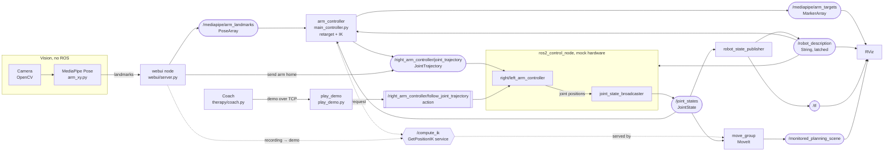
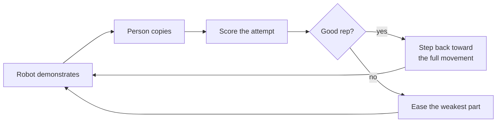

# AOT BracketBot

Action Observation Therapy with a simulated BracketBot. The robot demonstrates
an arm movement in RViz, a webcam scores how well you copy it, and the next
demonstration adapts.

Ubuntu 24.04 (WSL works), ROS 2 Jazzy, MoveIt 2, MediaPipe.

## Quick start

Setup:

    ./gazebo_sim/install_ros2_jazzy.sh
    sudo apt install ros-jazzy-moveit ros-jazzy-moveit-configs-utils \
        ros-jazzy-ros2-control ros-jazzy-ros2-controllers ros-jazzy-rosbag2
    ./MediaPipe/setup_wsl.sh
    cd ros2_ws && colcon build --symlink-install && cd ..

Run webpage:

    webui/run.sh --camera http://<phone-ip>:4747/video   # or --camera 0, or --camera fake
    # open http://localhost:8765

- **Record**: save a movement while the robot mirrors you.
- **Coach**: the robot demonstrates, you copy, it adapts.
- **Mirror**: the robot copies you live.

## How it works

Rectangles: nodes. Rounded: topics (publisher → topic → subscriber). Hexagon:
service. Double box: action. The left arm uses `left_arm_controller`.

1. **Camera**: OpenCV reads a webcam or phone stream.
2. **Landmarks**: MediaPipe finds shoulder, elbow, wrist and hand in one body
   plane (side, front or top). Published on `/mediapipe/arm_landmarks`.
3. **Retarget**: the person's bone directions, scaled to the robot's bone
   lengths and anchored at its shoulder (`therapy/retarget.py`).
4. **IK**: `/compute_ik` returns joint angles within the joint limits.
5. **Motion**: the angles go to the arm controller; RViz shows the result.

**Coaching** converts a recording with `/compute_ik` beforehand, then
`play_demo.py` plays it through the `follow_joint_trajectory` action.

## Adaptive coaching

Robot and person are compared as hand paths relative to the shoulder, in arm
lengths. Seven scores (0–1); a weighted total of 75+ is a good rep.

- **Shape**: same path? Else slower.
- **Reach**: as far? Else smaller and slower.
- **Height**: as high? Else pause at the top.
- **Direction**: right way? Else slower.
- **Elbow**: straightened as much? Else show only that part, slower.
- **Smoothness**: one clean movement? Else slower.
- **Tempo**: same pace? Else adjust speed.

3 good reps in a row: back toward the full movement. 3 worsening reps: short
rest. Details in [therapy/README.md](therapy/README.md).

## Layout

| Path | What |
| --- | --- |
| `webui/` | web interface ([README](webui/README.md)) |
| `therapy/` | coaching loop ([README](therapy/README.md)) |
| `MediaPipe/` | webcam → arm landmarks |
| `main_controller.py` | landmarks → robot joints via IK |
| `bracketbot_moveit_config/` | MoveIt config, launch files ([README](bracketbot_moveit_config/README.md)) |
| `chopped_urdf_v2/` | robot URDF and meshes |
| `chopped_urdf_v2_gazebo/`, `gazebo_sim/` | optional Gazebo sim ([README](gazebo_sim/README.md)) |
| `trajectories/` | example recordings |
| `ros2_ws/` | colcon workspace |
| `visualize_urdf.py`, `view_urdf.sh` | URDF viewer (Rerun, no ROS) |
| `local/` | git-ignored: recordings, demos, sessions |

## Other commands

| Command | What |
| --- | --- |
| `ros2 launch bracketbot_moveit_config demo.launch.py` | RViz teleop |
| `ros2 launch bracketbot_moveit_config mediapipe_live.launch.py camera:=<url>` | mirror without the webpage |
| `ros2 launch bracketbot_moveit_config mediapipe_replay.launch.py recording:=latest` | replay a recording |
| `python -m therapy.coach therapy/demos/throw_keyframes.csv --child fake --robot stub-fast --no-window` | coaching, no camera or robot |
| `ros2 launch chopped_urdf_v2_gazebo sim.launch.py` | Gazebo |
| `./view_urdf.sh --urdf chopped_urdf_v2/urdf/chopped_urdf_v2.urdf` | URDF in Rerun |

## Robot model

- 7 joints per arm: `rj0`/`lj0` slides along the mast (−1.03..0 m); `rj1`–`rj6` revolute (±2.09 rad).
- Elbows (`rj3`/`lj3`) bend one way only.
- Grippers: one joint each (0..1 rad).
- IK: base `arm_base`, end effectors `right_eef`/`left_eef`. Mirroring excludes the mast joint.
